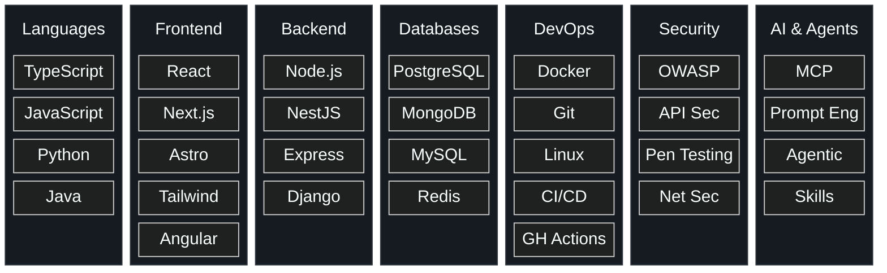

# Hi, I'm Cristian 👋

Software & Systems Engineer

I design software systems through structure, modularity, and careful decomposition of complexity.
I also read philosophy, write about what I learn, and occasionally break into systems — legally... 🤫

---

#### Currently

- 🔧 &nbsp; Building full-stack systems — system design, API boundaries, modular architecture
- 🎓 &nbsp; B.Sc. Systems Engineering — Universidad Mayor de San Simón
- 🛡️ &nbsp; Postgraduate Diploma in Information & Technology Security
- 🌐 &nbsp; Studying advanced English at Cambridge English Centre
- 📖 &nbsp; Reading, writing, and thinking about software and philosophy

#### Tech Stack

#### Recent Blog Posts

| | Title | Topic |
|---|---|---|
| 📚 | [My Bookshelf](https://cristianarando.dev/en/blog/my-bookshelf) | Books, reading lists |
| 🏆 | [My Most Notable Reads](https://cristianarando.dev/en/blog/my-most-notable-reads) | Literature & philosophy tier list |
| 🛡️ | [Penetration Testing with OWASP](https://cristianarando.dev/en/blog/my-final-project) | Cybersecurity, thesis project |

More at → <a href="https://cristianarando.dev/en/blog">cristianarando.dev/blog</a>

#### On My Nightstand

> *"I swear to you that to think too much is a disease, a real, actual disease."*
> — Fyodor Dostoevsky, *Notes from Underground*

I caught the disease. Here's what's keeping me up at night:

| Status | Book | Author |
|---|---|---|
| 📖 | *Crime and Punishment* | Dostoevsky |
| 📖 | *The Brothers Karamazov* | Dostoevsky |
| 📖 | *The Stranger* | Camus |
| 📖 | *The Count of Monte Cristo* | Alexandre Dumas |
| ⏳ | *Critique of Pure Reason* | Immanuel Kant |

Full bookshelf → <a href="https://cristianarando.dev/en/blog/my-bookshelf">cristianarando.dev/blog/my-bookshelf</a>

---

[cristianarando.dev](https://cristianarando.dev) · [LinkedIn](https://linkedin.com/in/cristianarando) · [crisarandosyse@gmail.com](mailto:crisarandosyse@gmail.com)

